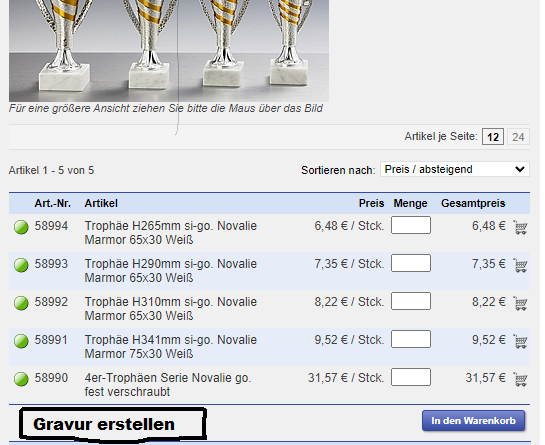
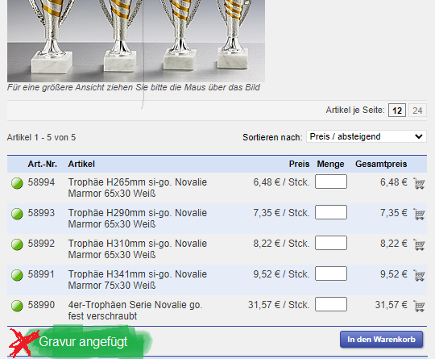
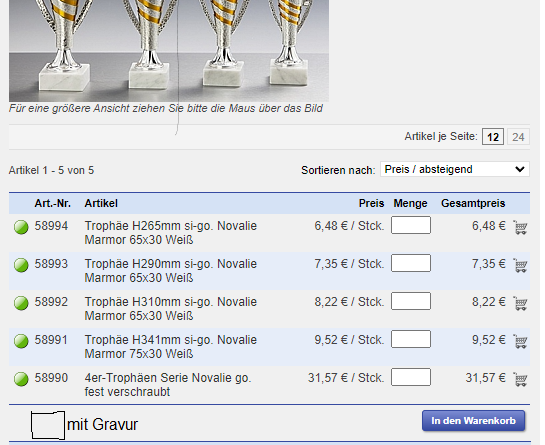
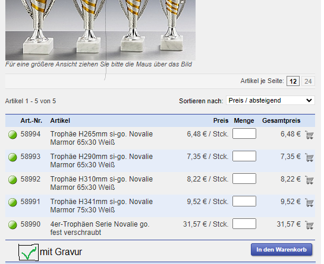

# Anbindung Konfigurator an Stieber Online-Shop

Es gibt zwei mögliche Verfahren den Konfigurator in den Online-Shop einzubinden. Im folgenden sind die beiden Verfahren mit ihren Vor- und Nachteilen grob skizziert.

1. [Verfahren 1](#verfahren1)
2. [Verfahren 2](#verfahren2)
3. [Unterschiede](#unterschiede)

##  Verfahren 1

- ### 1. Kunde klickt auf "Gravur erstellen" Button.
  

- ### 2. In einem neuen Browsertab wird der Konfigurator geöffnet.
- ### 3. Wenn der Kunde die Gravur fertigerstellt hat, kann er den Tab, in dem der Konfigurator läuft, wieder schließen. Der Link zu der erstellten Konfiguration wird zuvor an parity zurückgesendet. Die parity Seite kann nach Erhalt des Links zu der Konfiguration den "Gravur Erstellen" Button zu einem "Gravur angefügt" Hinweis ändern. Dies signalisiert dem Kunden, dass bei dem aktuellen Produkt eine Gravur enthalten ist.
    
  Über das X in neben dem Hinweis, kann der Kunde die Gravur wieder entfernen.
- ### 4. Nach Abschluss der Bestellung muss parity in der Bestellbestätigung bei jedem Artikel mit Gravur den Link zu der Konfiguration anfügen.

##  Verfahren 2
- ### 1. Kunde wählt die Checkbox "mit Gravur" aus
    
  
- ### 2. Bei Abschluss der Bestellung leitet parity die Auftragsnummer samt der Artikel mit Konfiguration über eine Schnittstelle an mein Programm weiter.
- ### 3. In der Bestellbestätigungsemail fügt parity einen Link zu meiner Seite ein, über den der Kunde alle seine Konfigurationen für eine Bestellung bearbeiten kann und eure Grafiker die erstellten Konfigurationen einsehen und downloaden können.

##  Unterschiede
- In Verfahren 1 erstellt der Kunde die Konfigurationen während des Bestellprozesses, während er in Verfahren 2 alle Konfigurationen nach Abschluss der Bestellung erstellt.
- Die Umsetzung von Verfahren 1 ist schwieriger, weil der Online-Shop und der Konfigurator in dem Bestellprozess interagieren müssen. In Verfahren 2 hingegen ist die Konfiguration ein komplett seperater Prozess, wodurch kaum Interaktion zwischen dem Online-Shop und dem Konfigurator nötig ist.
- In Bezug auf die Nutzererfahrung bleibt zu Gunste von Verfahren 2 zu erwähnen, dass der Bestellprozess des Benutzers nicht unterbrochen wird. Bei Verfahren 1 ist das zwar der Fall, aber andererseits ist bei Abschluss der Bestellung auch alles schon erledigt.

